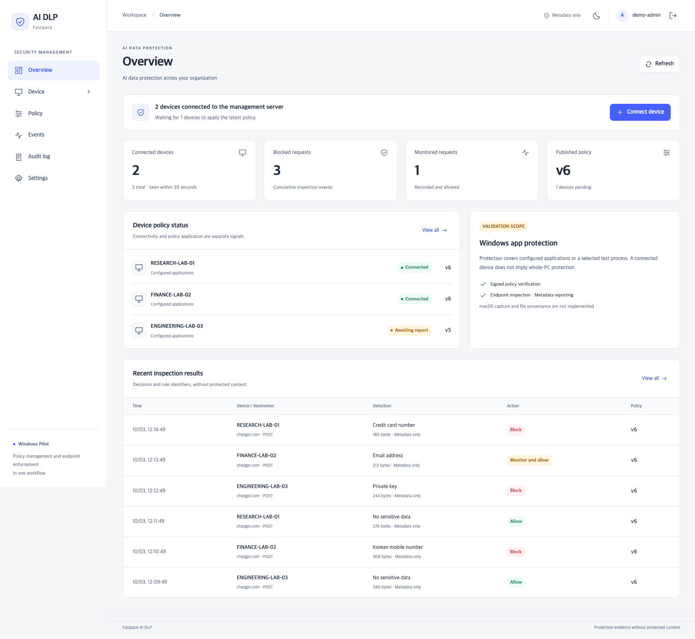
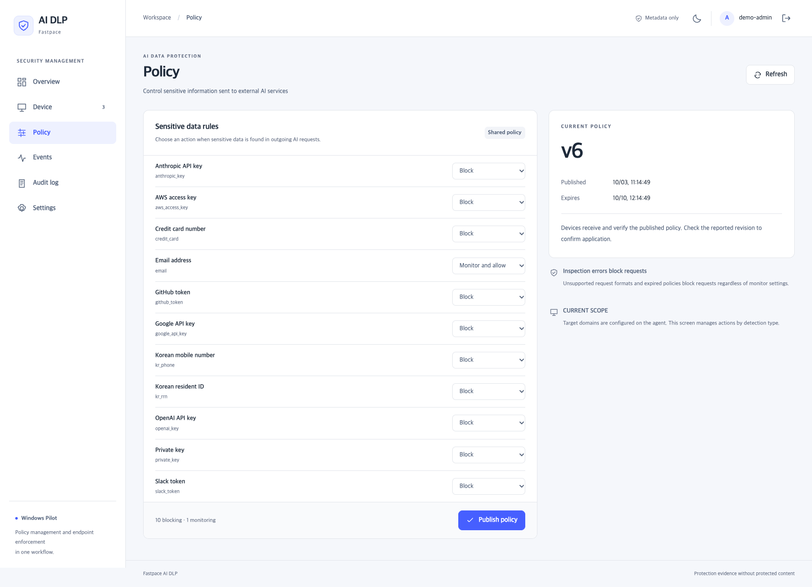
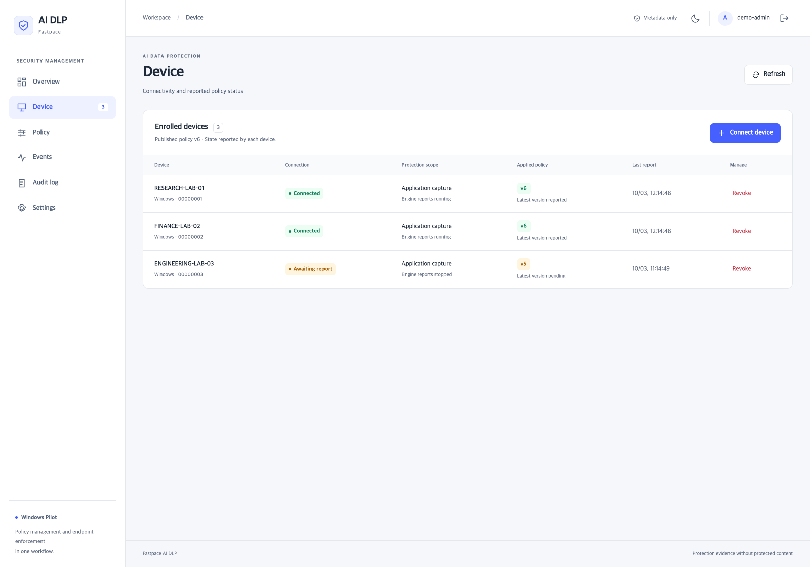
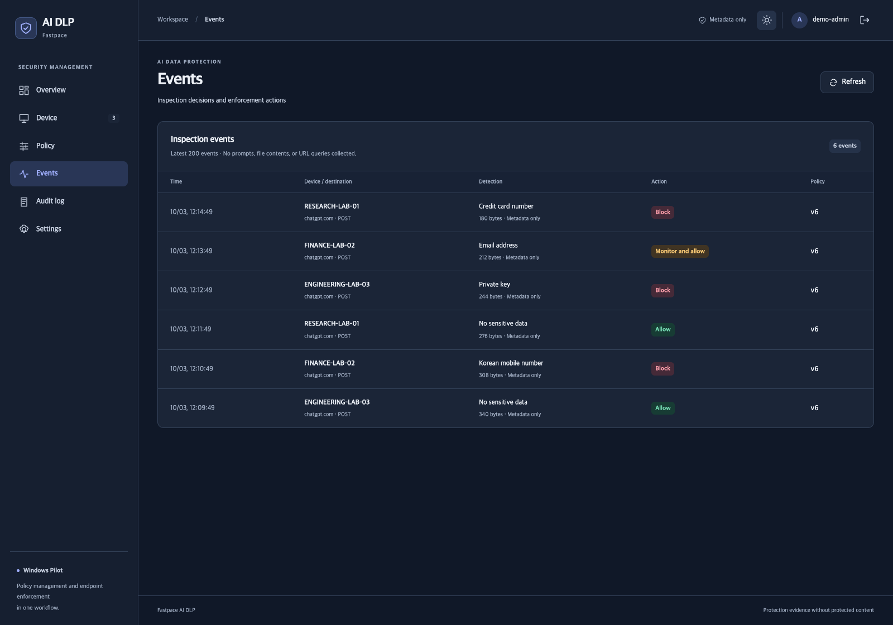

# EP AI DLP — エンドポイント AI データ保護

**Windows アプリから AI サービスへ機密情報が送信される前に、検査と制御を行う境界を探ります。**

[English](README.md) · [한국어](README.ko.md) · [简体中文](README.zh-CN.md) · [日本語](README.ja.md) · [Español](README.es.md) · [Français](README.fr.md)

> 実験段階の研究プレビューです。本番用 DLP の代替や完全な情報漏えい防止を保証しません。英語 README が基準文書で、管理コンソールは英語です。

実際のコンソールに合成 UI データを表示しています。端末名、件数、ポリシー状態は例示であり、顧客の利用状況や実際の遮断証拠ではありません。



<table><tr><td width="50%"></td><td width="50%"></td></tr></table>



## 実装済みの範囲

- Rust ランタイムによる選択的 TCP/TLS 検査、上限付きリクエスト解析、決定的な検出。
- 設定した実行ファイルのパスに一致する新規プロセスを捕捉する Windows サービス。この経路では専用ブラウザプロファイルやプロキシ起動オプションは不要です。
- 11 種類のルール：認証情報パターン、秘密鍵マーカー、メール、カード番号、韓国の携帯電話番号・住民登録番号。
- 一度限りの登録、端末に結び付けた Ed25519 署名ポリシー、ルール別の遮断・監視、適用版の報告。
- Next.js・NestJS・PostgreSQL 管理コンソール。イベントには保護対象の本文を含めず、メタデータのみを記録。

単一テナントの共通ポリシーです。対象ドメインと実行ファイルはエージェント側で設定します。応答検査、ファイル抽出、文脈分類、Agent IAM は含みません。

```text
Windows application -> TCP capture -> Rust TLS / DLP -> AI destination
                           ^
                  signed policy / metadata
                           |
              Next.js -> NestJS -> PostgreSQL
```

## ローカルコンソールの起動

Node.js 22.19+、npm、Docker Compose が必要です。コンソールを起動するだけでは端末は保護されません。

```bash
git clone https://github.com/hellocosmos/ep-ai-dlp.git
cd ep-ai-dlp
npm ci
npm run bootstrap
docker compose --env-file .local/managed.env -f deploy/compose.yaml up -d
npm run build
```

別々のターミナルで `npm run dev:server` と `npm run start:console` を実行し、`http://127.0.0.1:3100` を開きます。初期認証情報はランダム生成され、非公開の `.local/managed.env` に保存されます。

## 検証結果と制限

管理下の Windows HTTPS 宛先で正常リクエストの到達と合成機密リクエストの未到達を確認しました。サービス再起動後の通常 Chrome の許可・遮断、および正常な ChatGPT 会話を1回確認しました。広範なサービス互換性の証明ではありません。

**ChatGPT の補助リクエストには誤検知の可能性が残っています。実ファイルのアップロード、他のブラウザ・サービス、遮断通知、性能、再起動・クラッシュ復旧、改ざん耐性は追加検証が必要です。サービス停止で捕捉が解除される可能性があり、継続的な fail-closed 保護は保証しません。macOS 捕捉と不変監査ストレージは未実装です。**

## 公開の目的

サイバーセキュリティ製品アーキテクト Jaemyung Kim が設計・検証し、AI coding agent の支援で実装しました。アーキテクチャ、脅威モデル、受入基準、限界を共有します。

独自コードは MIT、Windows redirector・WinDivert などの第三者コンポーネントには各ライセンスが適用されます。旧 Python ブラウザ・.NET 実験は別経路として保持しています。運用認証情報、実験の生データ、内部事業文書は公開版に含めません。

[English reference](README.md) · [Setup](docs/getting-started.md) · [Windows lab](docs/windows-lab.md) · [Architecture](docs/architecture.md) · [Validation](docs/validation.md) · [Screenshots](docs/screenshot-provenance.md) · [Security](SECURITY.md) · [Licenses](THIRD_PARTY.md)
